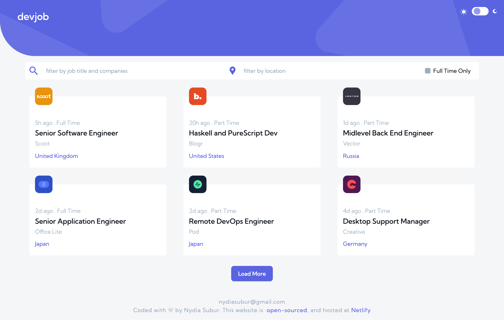
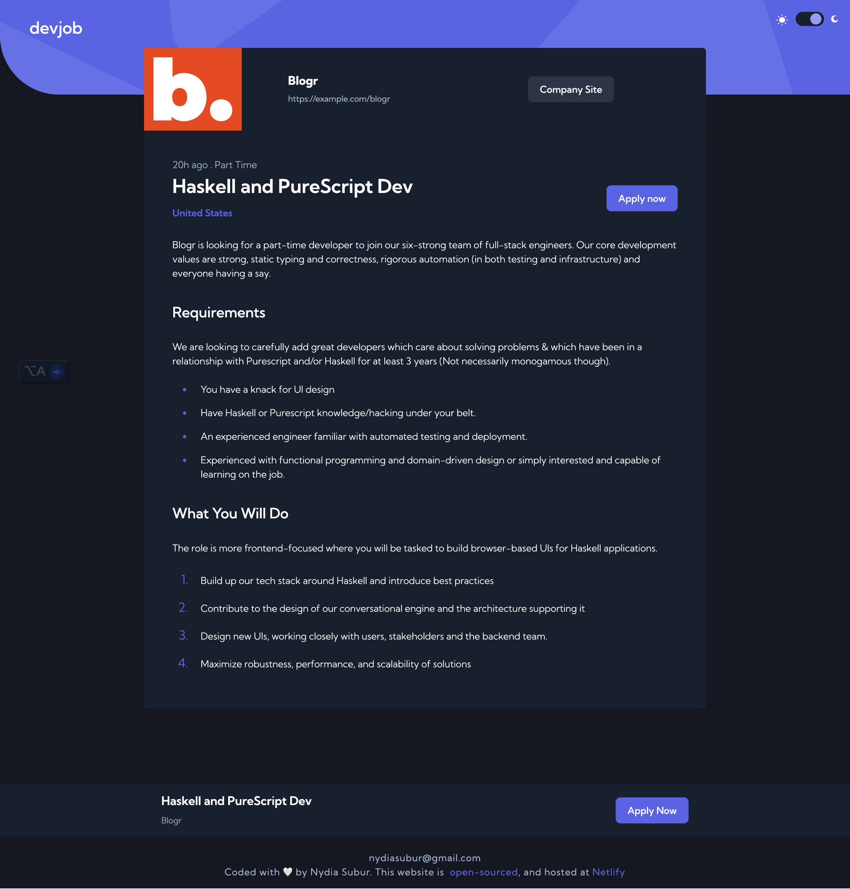
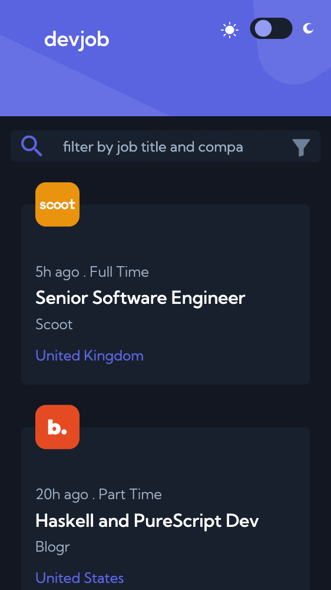

# Frontend Mentor - Devjobs web app solution

## Table of contents

- [Overview](#overview)
  - [The challenge / Functionalities Implemented](#the-challenge--functionalities-implemented)
  - [Screenshot](#screenshot)
  - [Links](#links)
- [My process](#my-process)
  - [Built with](#built-with)
  - [3 main things learned in this project](#3-main-things-learned-in-this-project)
  - [Continued development](#continued-development)
  - [Useful resources](#useful-resources)
- [Author](#author)
- [Acknowledgments](#acknowledgments)

## Overview

This is a solution to the [Devjobs web app challenge on Frontend Mentor](https://www.frontendmentor.io/challenges/devjobs-web-app-HuvC_LP4l). Mimicking realistic projects, I was given a Figma design to materialize the project that i built with ReactJS, Vanilla CSS and Bootstrap, hosted at Netlify.

### The challenge / Functionalities Implemented

Users should be able to:

- View the optimal layout for each page depending on their device's screen size
- See hover states for all interactive elements throughout the site
- Be able to filter jobs on the home page by Job position's title, location, and whether a job is for a full-time position
- Be able to select a "light mode" or "dark mode" theme and have the broswer remember their selected preference when the page is revisited.
- Be able to click a job from the index page so that they can read more information and apply for the job

### Screenshot






### Links

- Live Site URL: https://dev-job-web-app-react.netlify.app/

## My process

1. Static Layout: I began by building the static HTML and CSS for the homepage to establish the visual structure.
2. Component Breakdown: I then identified reusable UI elements and refactored them into smaller, modular React components for cleaner code and better maintainability.
3. State Management: After defining the components, I carefully planned the state management hierarchy, ensuring that state was shared efficiently between components for optimal performance.
4. Iteration: I iterated as needed, checking if any components could be further simplified or broken down.

### Built with

- [React](https://reactjs.org/) - JavaScript library
- Semantic HTML5 markup
- Vanilla CSS
- Bootstrap 5.3
- [useLocalStorage] (https://www.npmjs.com/package/use-local-storage) - Custom React hook for local storage management

# 3 main things learned in this project

## 1. Conditionally Rendering with State

In this project, I learned how to efficiently conditionally render UI elements based on the state, particularly using the && operator. For instance, in the snippet below, I only display the "Load More" button when the temporary job list is shorter than the original job list.

```jsx:
{temporaryJobListForLoadMore.length < jobList.length && (
    <button
      className="btn load-more-button main-button-style"
      onClick={() => setPage(page + 1)}
    >
      Load More
    </button>
)}
```

## 2. Handling Multiple Inputs and Filtering Logic

A key challenge in this project was handling multiple inputs and dynamically rendering the UI based on user input. The search bar on the homepage processes three main filters:

1. Job position (text input)
2. Location (text input)
3. Full-time job checkbox

To achieve this, I carefully managed the component states, including originalJobList to store the unfiltered data and jobList to store the filtered results. These states (stored at the home page component) were shared with child components to enable smooth filtering logic. The search bar component below takes in originalJobList, jobList, and setJobList as props and applies filter functions accordingly.

```jsx
export default function SearchBar({ originalJobList, jobList, setJobList }) {
  {/*... the rest of the code above*/}
 <input
  type="text"
    className="form-control text-input-style d-none d-md-block"
    aria-label="location filter"
    placeholder="filter by location"
    onChange={handleFilterByLocation}
    style={{ backgroundColor: "var(--white)" }}
  />

    <div className="checkbox-container ">
      <input
        className="form-check-input align-self-center d-none d-md-block"
        type="checkbox"
        value=""
        id="full-time-filter-checkbox"
        onChange={handleFullTimeOnlyCheckbox}
      />
      <label
        className="form-check-label d-none d-md-block "
        for="full-time-filter-checkbox"
      >
        Full Time Only
      </label>
    </div>
}
```

The 3 main functions of my jsx to handle the filter function are as follows:

# 1. Filter by Job Title or Company

This function filters the job list based on user input in the job title or company field. It updates the state to trigger re-rendering of the filtered results.

```js
function handleFilterByTitleOrCompanies(e) {
  let userInput = e.target.value;
  if (userInput.length > 0) {
    setJobList(
      originalJobList.filter(
        (job) =>
          job.position.toLowerCase().includes(userInput.toLowerCase()) ||
          job.company.toLowerCase().includes(userInput.toLowerCase())
      )
    );
  } else {
    setJobList(originalJobList);
  }
}
```

# 2. Full-Time Job Filter

This function filters the job list to show only full-time positions when the checkbox is selected. If unchecked, it restores the full job list.

```jsx
function handleFullTimeOnlyCheckbox(e) {
  fullTimeOnly = e.target.checked;
  if (fullTimeOnly) {
    // filter jobs to show only full time, update State with new list
    setJobList(jobList.filter((job) => job.contract === "Full Time"));
  } else {
    // filter jobs to show all, update State with the original list!
    setJobList(originalJobList);
  }
}
x;
```

# 3. Filter by Location

This function filters the job list based on the user’s location input. It updates the jobList state with matching results or restores the original list if the input is cleared.

```jsx
function handleFilterByLocation(e) {
  let userLocationInput = e.target.value;
  if (userLocationInput.length > 0) {
    setJobList(
      originalJobList.filter((job) =>
        job.location.toLowerCase().includes(userLocationInput.toLowerCase())
      )
    );
  } else {
    setJobList(originalJobList);
  }
}
```

## 3.Custom CSS Variable/attribute selector and Using useEffect to Access Attributes/Properties Outside of the Component

In this project, one of the key things I learned was how to use the [data-theme="dark"] attribute selector in CSS to dynamically apply styles based on the theme. By leveraging CSS variables and this attribute, I was able to efficiently switch between light and dark modes.

Using [data-theme="dark"] in CSS
I used the [data-theme="dark"] attribute to target and change the styles for dark mode without manually applying class-based styles. This allowed me to declare the default (light) theme in the :root pseudo-class and switch to dark mode by setting the data-theme="dark" attribute on the <body> element.

```css
:root {
  /*primary colors*/
  --violet: #5a64e0;
  --secondary-violet: #5a64e0;
  --light-violet: #939bf4;
  --light-violet-low-opacity: rgba(147, 155, 244, 0.2);
  --very-dark-blue: #19202d;
  --midnight: #121721;
  /*secondary colors*/
  --white: #ffffff;
  --light-grey: #f4f6f8;
  --gray: #9daec2;
  --dark-grey: #6e8098;
  --main-button-font: white;
}

[data-theme="dark"] {
  --light-grey: #121721;
  --white: #19202d;
  --secondary-violet: white;
  --light-violet-low-opacity: rgba(
    110,
    128,
    152,
    0.2
  ); /*seconday button equivalent*/
  --dark-grey: #f4f6f8; /*dark grey becomes light grey*/
  --midnight: white;
}
```

Using useEffect to Toggle Themes

In React, I used the useEffect hook to dynamically apply the theme by toggling the data-theme attribute on the <body> element. The CSS [data-theme="dark"] rule automatically applied the appropriate styles when the attribute was set to "dark".

```jsx
export default function ({ isDarkMode, setIsDarkMode }) {
  useEffect(() => {
    // Set the data-theme attribute on the body tag
    if (isDarkMode) {
      document.body.setAttribute("data-theme", "dark");
    } else {
      document.body.setAttribute("data-theme", "");
    }
  }, [isDarkMode]);
  //handleThemeChange function:
  //if there's a change in the checkbox, set isDarkMode to the opposite of its current value
  //at useEffect, detect if there's a change in isDarkMode, if there is,
  //set the data - theme attribute on the body tag to either "dark" or "light"
}
```

### Continued development

1. **Full-stack development**: In the next phase, I aim to transition this project into a full-stack application by incorporating a back-end using Node.js and Express. This will allow me to manage server-side logic, authentication, and database interactions.

2. **API integration**: I also plan to enhance the project by fetching real data from an external API. This will involve working with RESTful or GraphQL APIs to provide dynamic content and ensure the project reflects real-world use cases.

### Useful resources

- [React Dark Mode Toggle/Theme](https://www.youtube.com/watch?v=sy-rRtT84CQ&t=664s) - Inspired me to create Dark mode theme. Learned about the custom CSS attribute selector here!
- [Load More Button React Js Material UI Project](https://www.youtube.com/watch?v=2YrLdk5t2ec&t=670s) - Youtube vid that helped inspired me to build the load more functionality solution with react.

## Author

- Website - [Nydia Subur](https://nydia-subur-portfolio.netlify.app/)
- Frontend Mentor - [@nydiasubur](https://www.frontendmentor.io/profile/nydiasubur)
- Twitter - [@nydiasubur](https://x.com/nydiasubur)
